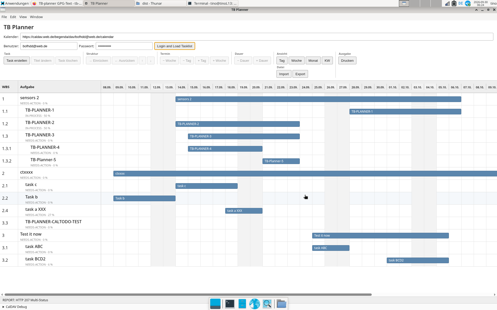

# TB Planner JS

TB Planner JS is an Electron-based task planner that works with tasks stored as CalDAV VTODO items. It provides a graphical planning interface with WBS hierarchy, Gantt-style timeline views, task editing, task structure operations, JSON import/export, and a print preview.

The project is the JavaScript/Electron continuation of the TB Planner concept originally developed around Thunderbird.

<p align="center">
  
</p>

## Features

### Task management

- Load tasks from a CalDAV calendar.
- Create new tasks.
- Edit existing tasks.
- Change task titles and descriptions.
- Set start date and due date.
- Set task duration.
- Set status and completion percentage.
- Delete tasks.
- Save changes back to the CalDAV server using VTODO/CalDAV operations.

### WBS / task structure

Tasks can be organized hierarchically using WBS numbers.

Supported structure operations include:

- Indent task
- Outdent task
- Move task up
- Move task down
- WBS recalculation
- Parent/child relationships
- Explicit task ordering

The WBS, parent relationship and order are stored with the VTODO data.

### Timeline / zoom levels

The planner contains a Gantt-style timeline with several zoom levels:

- Day
- Week
- Calendar week
- Month

The timeline displays the task schedule while preserving the planner's task hierarchy.

The month view uses compact month labels such as `OCT`, `NOV`, etc.

### Aggregate tasks

Aggregate/summary task calculation is part of the planner concept.

The intended calculation is based on the WBS hierarchy:

- earliest start of the child tasks
- latest end of the child tasks

The handling of aggregate tasks is an ongoing development area.

### Print preview

The planner provides an Electron print-preview window.

The preview deliberately does **not** print the Gantt graphic. Instead it displays the task list and task information in a dedicated preview window.

The preview contains:

- WBS
- Task title
- Start
- End
- Duration
- Status
- Description

The preview can export the task list as an A4 landscape PDF.

### JSON export

The current task list can be exported as JSON.

The exported format contains:

- format identifier
- format version
- export timestamp
- task list
- UID
- title
- description
- status
- completion percentage
- start date
- due date
- WBS
- parent
- order
- CalDAV resource information

Example:

```json
{
  "format": "tb-planner-json",
  "version": 1,
  "exportedAt": "2026-09-29T19:09:01.155Z",
  "tasks": [
    {
      "uid": "...",
      "summary": "Example task",
      "description": "Description",
      "status": "NEEDS-ACTION",
      "percentComplete": 0,
      "dtstart": "20260929",
      "due": "20261002",
      "wbs": "1.1",
      "parent": "...",
      "order": 1
    }
  ]
}
```

### JSON import

A JSON export can be imported again.

Import deliberately replaces the tasks currently present in the selected calendar:

1. Select a JSON file.
2. Validate the JSON structure.
3. Confirm the replacement.
4. Delete the currently existing tasks.
5. Sort imported tasks so parents are created before children.
6. Re-create the tasks using CalDAV `PUT`.
7. Preserve UID, WBS, parent and order.
8. Reload the calendar.

Server-specific `href` and `etag` values from the export are not reused. New CalDAV resource URLs are created from the current calendar URL and the preserved UID.

## Architecture

The application consists of three main layers.

### Renderer

Located in:

```text
src/
├── index.html
├── css/
│   └── style.css
└── js/
    ├── app.js
    └── caldav.js
```

`app.js` contains the planner logic and user interface behavior.

`caldav.js` contains the CalDAV communication layer.

### Electron main process

Located in:

```text
electron/
├── main.js
└── preload.js
```

The Electron main process provides functionality that should not be performed directly from the renderer, including:

- CalDAV HTTP communication where required
- native file dialogs
- JSON import/export file handling
- print preview window
- PDF generation

The preload script exposes the required functions to the renderer through the Electron context bridge.

## CalDAV

The planner uses CalDAV VTODO resources.

The application communicates with the configured calendar and performs operations such as:

- `OPTIONS`
- `PROPFIND`
- `REPORT`
- `PUT`
- `DELETE`

The VTODO data contains planner-specific information such as WBS, parent and order in addition to normal task information.

The planner therefore keeps the planning structure in the calendar data rather than maintaining a separate planning database.

## Running the application

Install the Node.js dependencies first:

```bash
npm install
```

Start the Electron application with:

```bash
npm start
```

## Development

The project is intended to remain lightweight and terminal-friendly.

Useful checks after source modifications:

```bash
node --check electron/main.js
node --check electron/preload.js
node --check src/js/app.js
```

Git status:

```bash
git status
```

## Project structure

```text
tb-planner-js/
├── electron/
│   ├── main.js
│   └── preload.js
├── src/
│   ├── css/
│   │   └── style.css
│   ├── js/
│   │   ├── app.js
│   │   └── caldav.js
│   └── index.html
├── package.json
└── README.md
```

## Current development status

The following functionality is currently implemented:

- CalDAV task loading
- VTODO task creation
- VTODO task editing
- VTODO task deletion
- WBS hierarchy
- Parent/child relationships
- Indent/outdent operations
- Move up/down operations
- Day/week/calendar-week/month timeline views
- Task creation and editing UI
- Read-only task display
- JSON export
- JSON import
- Electron print preview
- A4 landscape PDF task-list output

Known development topics include:

- refinement of aggregate/summary task calculation
- further refinement of timeline presentation
- additional planner functionality

## Design principle

TB Planner JS is intentionally based on standard web technologies and Electron rather than requiring a large external application stack.

The planner UI runs locally while the task data can remain on an existing CalDAV server.

The JSON import/export functionality also provides a simple way to back up or transfer the planner's task structure independently of the graphical planner.

## Repository

GitHub:

https://github.com/tino1003870/tb-planner-js
